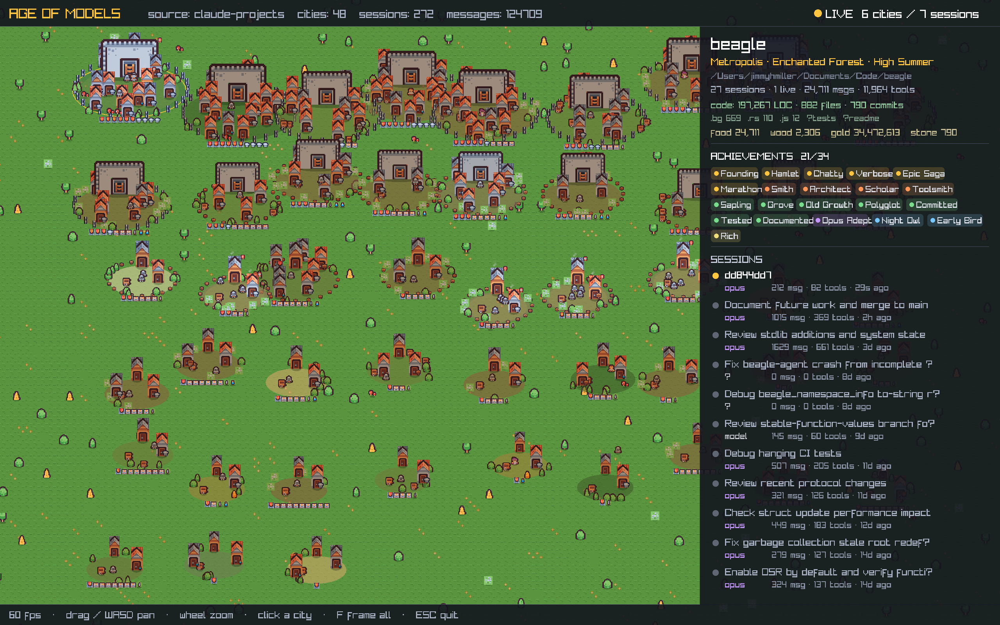

# Age of Models

A deliberately silly Age-of-Empires-style RTS map that visualizes **live AI / Claude
session activity** as a little medieval world. Built in Rust on
[raylib](https://docs.rs/raylib).

Each of your projects becomes a **city**. Each agent **session** becomes a building.
Activity becomes **villagers** who wander the town and occasionally trek across the
map to trade with another project. When a session is active *right now*, its building
raises a banner and puffs smoke.



> The screenshot above is the real thing: every city is a project under
> `~/.claude/projects`, and the inspector on the right lists actual session titles,
> models, and message counts.

## What maps to what

| Game thing        | Real thing                                                    |
|-------------------|---------------------------------------------------------------|
| City              | A project (one directory under `~/.claude/projects`)          |
| Town center (castle) | The project itself                                         |
| House             | A session in that project                                     |
| Banner + smoke    | A session that was active within the last 10 minutes          |
| Villager          | A worker; the count grows with how busy the project is        |
| Villager sprite   | The model doing the work — knight = Opus, peasant = Sonnet, ranger = Haiku |
| Villager on a trip| Cross-project movement (a "trade route" between cities)       |
| Market stall      | The plaza hub the trade villagers head for                    |

### Variety — read your whole dev life as a map

Two cities should never look the same at a glance. See [`DESIGN.md`](DESIGN.md) for the
full design.

| System | What it shows | Driven by |
|--------|---------------|-----------|
| **Age / tier** | Outpost → Hamlet → Village → Town → City → Metropolis: bigger footprint, more houses, a castle keep, then walls | cumulative activity (messages + 2·tools) |
| **Biome** | The plaza colour + decorations — Forge Hills, Enchanted Forest, The Coast, Trade Port, Ancient Stone… | dominant language in the codebase on disk |
| **Season** | A tint over the whole city: High Summer (live) → Autumn → Winter → Dormant (overgrown) | how recently you worked there |
| **Building type** | A prop on each house — forge anvil, library signpost, barracks banner, harbor stall | the session's dominant tool (Bash/Read/Task/Web…) |
| **Monuments** | A trophy shelf of icons in front of the city | unlocked achievements |

### Achievements for a codebase

34 achievements, evaluated from **real** metrics only (never faked — if a signal is
missing, the achievement just can't unlock). They become monuments in the city and a
badge wall in the inspector. Examples:

- **Activity** — Founding, Chatty (1k msgs), Epic Saga (20k), Marathon (a 400-msg session)
- **Craft** — Smith (500 Bash), Scholar (1k reads), General (30 subagents), Toolsmith (5k tools)
- **Codebase** — Grove (10k LOC), Old Growth (100k), Polyglot (4+ languages), Committed
  (200 commits), Ancient (6+ months), Tested, Documented
- **Mastery** — Opus/Sonnet/Haiku adept, Triumvirate (all three)
- **Time** — Night Owl, Early Bird, Veteran (active 30+ days)
- **Wealth** — Rich (10M tokens), Tycoon (100M)

The inspector also reads out the four classic resources, mapped to real metrics:
**food** = messages, **wood** = edits, **gold** = tokens, **stone** = commits.

## Run it

```sh
cargo run --release                 # live: read ~/.claude/projects
cargo run --release -- --mock       # synthetic demo data (no real logs needed)
cargo run --release -- --screenshot out.png   # render headless, save a PNG
```

(Needs an active display — it opens a real GL window.)

### Controls

| Input                       | Action                              |
|-----------------------------|-------------------------------------|
| drag, or `WASD` / arrows    | pan the camera                      |
| mouse wheel                 | zoom (toward the cursor)            |
| click a city                | open its inspector (sessions, models, activity) |
| hover a building            | quick tooltip for that session      |
| `F`                         | frame all cities                    |
| `Esc`                       | quit                                |

## The pluggable data layer

The game reads from exactly one thing — a [`WorldSource`](src/data/mod.rs) — and
never touches the filesystem, an API, or Claude directly. To feed it from somewhere
new (a socket, an HTTP endpoint, a different agent runtime, a database), you implement
**one method** and hand it to the runner:

```rust
// types live in src/data/mod.rs
use crate::data::{WorldSource, WorldSnapshot, CityInfo, SessionInfo, SourceRunner};

struct MySource { /* ... */ }

impl WorldSource for MySource {
    fn name(&self) -> &str { "my-source" }
    fn poll(&mut self) -> WorldSnapshot {
        // build a Vec<CityInfo>, each with its Vec<SessionInfo>, set captured_at = now
        WorldSnapshot { cities: /* ... */ vec![], captured_at: now }
    }
}

// runs on a background thread, polls every 3s, never blocks the 60fps loop:
let runner = SourceRunner::spawn(Box::new(MySource::new()), 3.0);
```

The data model is intentionally small and source-agnostic
([`src/data/mod.rs`](src/data/mod.rs)):

- `WorldSnapshot { cities, captured_at }`
- `CityInfo { id, name, path, sessions }`
- `SessionInfo { id, title, model, user_messages, assistant_messages, tool_uses, first_active, last_active, git_branch }`

Two sources ship today:

- [`ClaudeProjectsSource`](src/data/claude.rs) — reads `~/.claude/projects/*/*.jsonl`
  (override the root with `CLAUDE_PROJECTS_DIR`). Caches parsing by file
  `(mtime, size)`, so re-polling 70+ projects with multi-MB logs only re-reads the
  files that changed.
- [`MockSource`](src/data/mock.rs) — synthetic, gently-evolving demo data.

## Architecture

```
src/
  data/        the pluggable source layer — the ONLY thing the game reads from
    mod.rs       WorldSource trait, WorldSnapshot/CityInfo/SessionInfo/ToolCounts/
                 CodebaseInfo, SourceRunner (bg thread)
    claude.rs    ClaudeProjectsSource (reads ~/.claude/projects; per-tool/token stats)
    repo.rs      cheap cached codebase scan (languages, LOC, files, commits, tests)
    mock.rs      MockSource (demo)
  achievements.rs  the 34-achievement catalog + Metrics, evaluated from real data
  game/
    mod.rs       World/City/Building/Villager, Tier/Biome/Season, snapshot->entities
  render/
    mod.rs       camera-space drawing + screen-space HUD/labels/inspector/monuments
    assets.rs    loads the Kenney atlases, names the tiles
  util.rs        time, deterministic RNG/hashing, RFC-3339 parsing (no chrono)
  main.rs        window, game loop, camera controls, --screenshot / --scan modes
```

Data lives on a background thread and arrives as immutable snapshots over a channel;
the game reconciles each snapshot into the world while preserving city positions and
villager motion, so the map stays stable as activity changes.

## Art / attribution

All art is **Kenney** (https://kenney.nl), CC0 1.0. See
[`ATTRIBUTION.md`](ATTRIBUTION.md). The original `License.txt` for each pack ships
alongside its atlas under `assets/`.
