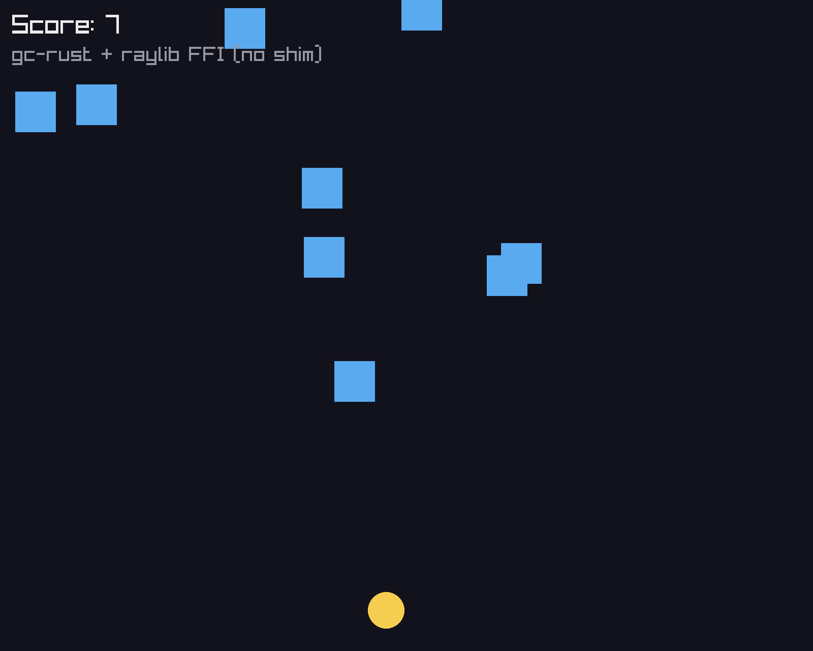

# gc-rust + raylib — a real game, proving the FFI (no shim)

A playable **Falling-Blocks Dodge** game written in gc-rust, rendered with
[raylib](https://www.raylib.com/). Move the yellow player with the **mouse**;
dodge the blue blocks; **R** restarts after a hit.



## Run it

This is a gc-rust project (`gcr.toml`), so — like cargo — it's one command from
this directory:

```sh
gcr run        # builds (linking raylib from gcr.toml [link]) and launches
```

No `--link-arg` flags: the `[link]` section of `gcr.toml` declares
`libs = ["raylib"]` + the macOS frameworks, and `gcr` passes them to the linker.
`gcr build` just builds (to `target/dodge`). Requires `raylib`
(`brew install raylib`) and a built compiler (`cargo build --bin gcr`).

To regenerate the screenshot: `gcr build shot.gcr && ./shot` (a bare-file build
inside the project still picks up the `[link]` config).

## What it proves

- **gc-rust calls raylib's C API directly — including `Color`-by-value.** There
  is **no C shim**. `ClearBackground(Color)`, `DrawCircle(int,int,float,Color)`,
  `DrawRectangle(...,Color)`, `DrawText(...,Color)` all take a `Color` struct
  **by value**, and gc-rust passes it per the platform C ABI (AAPCS64): a 4-byte
  `Color` is coerced into a general register, exactly as `clang` does. A
  homogeneous-float aggregate like `Vector2 {f32,f32}` goes in SIMD registers,
  and small structs are returned the same way. See `docs/ffi.md` and
  `abi_coerce` in `src/codegen.rs`.
- **Strings and bools cross too.** `InitWindow(..., const char*)` via
  `as_c_bytes`; `WindowShouldClose() -> bool` / `IsKeyDown(int) -> bool`.
- **GC and FFI coexisting under load.** Game state is a `Vec<Block>` of GC-heap
  structs, rebuilt every frame (off-screen blocks become garbage), so the moving
  generational collector runs continuously while native rendering happens. Safe
  because only scalars / by-value PODs cross the boundary — GC pointers never do,
  so the collector is free to relocate objects between frames.

## Files

| file | what |
|------|------|
| `gcr.toml` | project manifest — package + the `[link]` raylib config |
| `dodge.gcr` | the game (gc-rust) — declares raylib's C functions and calls them directly |
| `shot.gcr` | deterministic screenshot harness |
