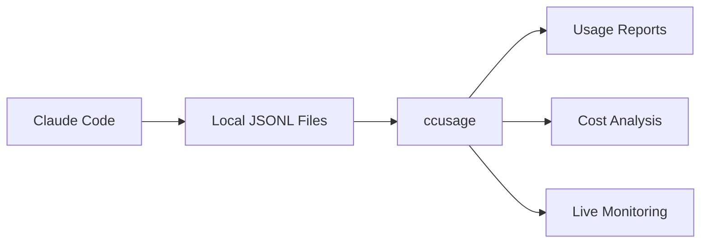

# Introduction

**ccusage** (claude-code-usage) is a powerful CLI tool that analyzes your Claude Code usage from local JSONL files to help you understand your token consumption patterns and estimated costs.

## The Problem

Claude Code's Max plan offers unlimited usage, which is fantastic! But many users are curious:

- How much am I actually using Claude Code?
- Which conversations are the most expensive?
- What would I be paying on a pay-per-use plan?
- Am I getting good value from my subscription?

## The Solution

ccusage analyzes the local JSONL files that Claude Code automatically generates and provides:

- **Detailed Usage Reports** - Daily, monthly, and session-based breakdowns
- **Cost Analysis** - Estimated costs based on token usage and model pricing
- **Live Monitoring** - Real-time tracking of active sessions
- **Multiple Formats** - Beautiful tables or JSON for further analysis

## How It Works

1. **Claude Code generates JSONL files** containing usage data
2. **ccusage reads these files** from your local machine
3. **Analyzes and aggregates** the data by date, session, or time blocks
4. **Calculates estimated costs** using model pricing information
5. **Presents results** in beautiful tables or JSON format

## Key Features

### 📊 Multiple Report Types

- **Daily Reports** - Usage aggregated by calendar date
- **Monthly Reports** - Monthly summaries with trends
- **Session Reports** - Per-conversation analysis
- **Blocks Reports** - 5-hour billing window tracking

### 💰 Cost Analysis

- Estimated costs based on token counts and model pricing
- Support for different cost calculation modes
- Model-specific pricing (Opus vs Sonnet vs other models)
- Cache token cost calculation

### 📈 Live Monitoring

- Real-time dashboard for active sessions
- Progress bars and burn rate calculations
- Token limit warnings and projections
- Automatic refresh with configurable intervals

### 🔧 Flexible Configuration

- Multiple Claude data directory support
- Environment variable configuration
- Custom date filtering and sorting
- Offline mode with cached pricing data

## Data Sources

ccusage reads from Claude Code's local data directories:

- **New location**: `~/.config/claude/projects/` (Claude Code v1.0.30+)
- **Legacy location**: `~/.claude/projects/` (pre-v1.0.30)

The tool automatically detects and aggregates data from both locations for compatibility.

## Privacy & Security

- **100% Local** - All analysis happens on your machine
- **No Data Transmission** - Your usage data never leaves your computer
- **Read-Only** - ccusage only reads files, never modifies them
- **Open Source** - Full transparency in how your data is processed

## Limitations

::: warning Important Limitations

- **Local Files Only** - Only analyzes data from your current machine
- **Language Model Tokens** - API calls for tools like Web Search are not included
- **Estimate Accuracy** - Costs are estimates and may not reflect actual billing
  :::

## Acknowledgments

Thanks to [@milliondev](https://note.com/milliondev) for the [original concept and approach](https://note.com/milliondev/n/n1d018da2d769) to Claude Code usage analysis.

## Getting Started

Ready to analyze your Claude Code usage? Check out our [Getting Started Guide](/guide/getting-started) to begin exploring your data!
