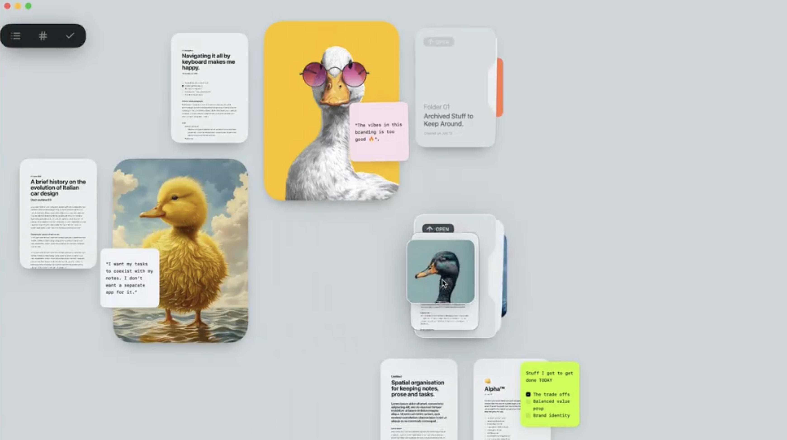

# Note Canvas Project

## Overview
A note-taking canvas app for macOS built with AppKit in Swift. The goal is to recreate a polished, highly animated interface similar to the reference design with support for various note types (text, images, PDFs, files, sticky notes) and folder groupings.



## Current Status

### ✅ Completed Features
- **Core Data Models**: Protocol-oriented design with `NoteItem` protocol, `TextNote`, `StickyNote`, `ImageNote`, and `Canvas` models
- **Base View System**: `BaseNoteView` with layer-based rendering (shadows, selection, rounded corners)
- **Visual Effects Library**: Reusable components for shadows, animations, and visual styling
- **Project Structure**: Proper Swift Package with library and executable targets
- **Build System**: App compiles and runs successfully
- **Individual Note Dragging**: Notes can be clicked and dragged to new positions
- **Multi-Note Dragging**: Selected notes move together maintaining relative positions
- **Selection System**: Click to select, Shift+Click for multi-select
- **Selection Rectangle**: Click and drag on empty canvas creates selection rectangle
- **Z-order Management**: Clicking a note brings it to front
- **Image Drag-and-Drop**: Drag images from Finder or web browsers onto canvas
- **Image Rendering**: Images display with rounded corners and proper scaling
- **Delete Functionality**: Delete key removes selected notes
- **Undo/Redo System**: Full undo/redo support with NSUndoManager (Cmd+Z, Cmd+Shift+Z)
- **Keyboard Event Handling**: App properly captures keyboard input with activation policy

### ⚠️ Partially Implemented (Needs Fixing)
- **Canvas Pan with Spacebar**: Code exists but spacebar+drag does not actually pan the canvas
- **Zoom with Trackpad**: Gesture recognizer exists but zoom transforms not applied to view
- **Text Note Content**: TextNoteView shows only rectangles, needs actual text rendering
- **Sticky Note Appearance**: StickyNoteView needs yellow paper background and tape effect
- **Text Editing**: TextNoteView has no text editing capability implemented

### ❌ Not Yet Implemented
- Working canvas pan with spacebar (event handling exists but doesn't update viewport)
- Functional zoom that scales the canvas content  
- Folder view with expand/collapse animations
- Resize handles on selected notes
- Context menus for notes
- Smooth animations for transitions
- Layout engine for snap-to-grid
- Theme system for consistent styling
- File/PDF note types
- Export functionality
- Save/Load canvas state

## Todo List

### High Priority
- [ ] **Fix spacebar canvas panning** - Spacebar detection works but viewport offset not updating view
- [ ] **Fix trackpad zoom** - Gesture recognizer exists but transforms not applied
- [ ] **Implement text note rendering** - Add actual text display in TextNoteView
- [ ] **Implement sticky note appearance** - Yellow background and tape effect
- [ ] **Add text editing** - Make TextNoteView editable with NSTextView
- [ ] **Build animation system** - Smooth transitions for note movement and selection

### Medium Priority
- [ ] **Create FolderView** - iPhone-style app groups with expand/collapse
- [ ] **Build interaction system** - Resize handles, context menus, drag-and-drop
- [ ] **Write UI tests** - Test user interactions and animations

### Low Priority
- [ ] **Create layout engine** - Automatic arrangement and snap-to-grid
- [ ] **Create theme system** - Consistent colors, fonts, and spacing

## Architecture Notes

### Data Flow
- `Canvas` class manages note collection and state using Combine `@Published` properties
- `CanvasView` observes canvas changes and updates note views reactively
- Individual note views inherit from `BaseNoteView` and implement `NoteViewProtocol`

### Key Design Decisions
- Protocol-oriented design for extensibility
- Separation of data models (`NoteItem`) from views (`NoteViewProtocol`)
- Layer-based rendering for visual effects
- Combine for reactive updates
- Public API design for library/app separation

## Known Issues
1. **Spacebar Panning**: Spacebar is detected but viewport offset changes don't update contentView position
2. **Zoom Transforms**: Magnification gesture captured but scale transform not applied to contentView
3. **Text Note Rendering**: TextNoteView shows only colored rectangles, no actual text content
4. **Sticky Note Appearance**: StickyNoteView lacks yellow paper background and tape effect
5. **Text Editing**: TextNoteView has no NSTextView or editing capability
6. **Performance**: No optimization for large numbers of notes

## Recently Added Features
- **Image Support**: Full drag-and-drop from Finder and web browsers with rounded corners
- **Delete Operations**: Delete key removes selected notes with proper undo support
- **Undo/Redo System**: Complete NSUndoManager integration for all operations
- **Keyboard Handling**: Proper app activation and first responder management

## Next Steps
1. **Fix viewport transforms** - Apply pan offset and zoom scale to contentView
2. **Implement text note rendering** - Add actual text display in TextNoteView
3. **Implement sticky note appearance** - Yellow background with tape effect
4. **Add text editing** - Integrate NSTextView for editable text notes
5. **Polish and optimize** - Smooth animations, performance improvements
6. **Add tests** - Ensure reliability and prevent regressions

## Build Instructions
```bash
swift build
swift run NoteCanvasApp
```

## Project Structure
```
NoteCanvas/
├── Sources/
│   ├── NoteCanvas/          # Main library
│   │   ├── Models/          # Data models
│   │   │   ├── NoteProtocol.swift      # Core protocols
│   │   │   ├── TextNote.swift          # Text note model
│   │   │   ├── StickyNote.swift        # Sticky note model
│   │   │   ├── ImageNote.swift         # Image note model
│   │   │   ├── FolderNote.swift        # Folder model
│   │   │   └── Canvas.swift            # Main canvas state
│   │   ├── Views/           # UI components
│   │   │   ├── NoteViewProtocol.swift  # Base view protocol
│   │   │   ├── CanvasView.swift        # Main canvas view
│   │   │   ├── TextNoteView.swift      # Text note rendering
│   │   │   ├── StickyNoteView.swift    # Sticky note rendering
│   │   │   └── ImageNoteView.swift     # Image note rendering
│   │   └── Utilities/       # Helper components
│   │       └── VisualEffects.swift     # Reusable effects
│   └── NoteCanvasApp/       # Executable app
│       └── main.swift       # App entry point
├── Tests/                   # Test files (empty)
├── Package.swift           # Swift package manifest
├── CLAUDE.md              # This documentation
└── reference-design.png   # UI reference image
```

## Key Files to Understand

### Core Models (`Sources/NoteCanvas/Models/`)
- **`NoteProtocol.swift`**: Defines `NoteItem` protocol that all notes implement
- **`Canvas.swift`**: Main state management with `@Published` properties for reactive updates
- **`TextNote.swift`**: Text note with font, alignment, content properties
- **`StickyNote.swift`**: Sticky note with color variants and tape effect
- **`AnyNote`**: Type-erased wrapper for heterogeneous note collections

### Core Views (`Sources/NoteCanvas/Views/`)
- **`CanvasView.swift`**: Main canvas with pan/zoom/selection (⚠️ needs debugging)
- **`BaseNoteView.swift`**: Shared note view logic with layers and mouse handling
- **Individual note views**: Render specific note types with proper styling

## Critical Issues to Fix First

### 1. Viewport Transform Application (`CanvasView.swift:updateViewport`)
The viewport offset is tracked but not applied to contentView's position. Need to:
- Apply CGAffineTransform or update frame origin when viewport offset changes
- Ensure zoom transforms are combined with pan transforms
- Update contentView bounds for proper clipping

### 2. Note Content Rendering
- Note views only show colored rectangles via BaseNoteView
- TextNoteView needs NSTextView integration for text display/editing
- StickyNoteView needs yellow paper background and tape effect
- ImageNoteView needs NSImageView for image display

### 3. Spacebar Pan Implementation
- Spacebar detection works but viewport updates don't move contentView
- Need to connect pan deltas to actual view transformation
- Consider using CGAffineTransform for smooth panning

## Design Patterns Used

### Protocol-Oriented Design
```swift
protocol NoteItem: Identifiable, Codable, Hashable {
    var position: CGPoint { get set }
    var size: CGSize { get set }
    // ... other common properties
}
```

### Reactive State Management
```swift
class Canvas: ObservableObject {
    @Published var notes: [AnyNote] = []
    @Published var selectedNotes: Set<UUID> = []
    // Canvas automatically updates views when these change
}
```

### Layer-Based Rendering
```swift
class BaseNoteView: NSView {
    var shadowLayer: CALayer!    // Drop shadow
    var contentLayer: CALayer!   // Main content
    var selectionLayer: CALayer! // Selection border
}
```

## Testing Strategy
1. **Manual Testing**: Run app and verify each interaction works
2. **Unit Tests**: Test data model logic and canvas state management
3. **Integration Tests**: Test view updates when canvas state changes
4. **UI Tests**: Test complete user workflows

## Architecture Dependencies
- **AppKit**: Core UI framework
- **Combine**: Reactive programming for data flow
- **CoreAnimation**: Layer-based animations and effects

## Reference Design Analysis
The target design shows:
- Various note types (text, images, sticky notes)
- Rounded corners and drop shadows
- Overlapping layout with depth
- Sticky notes with realistic tape effects
- Mixed content types (text documents, images, handwritten notes)
- Light background with subtle texture