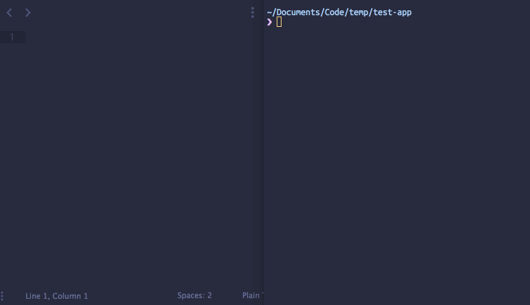

# Eslint-Fixit

Eslint-Fixit is an easy way to fix eslint violations. It allows you to open up each of the eslint violations in your editor so you can fix them quickly.

 

## Installation

**Yarn:**

```bash
yarn global add eslint eslint-fixit
```

**Npm:**

```bash
npm install -g eslint eslint-fixit
```

## Usage

You must already have eslint setup for your project. In the directory containing your project run:

```bash
eslint-fixit .
```

## Editor Setup

By default eslint-fixit is setup to use nano. But most likely, you don't use nano as your editor, so you can setup your own editor by adding an export for your editor in your `~/.bash_profile` (or equivilant if you use something other than bash).


```bash
# Vim
export ESLINT_FIXIT_EDITOR="vim \"+call cursor(%line, %column)\" %file"

# Sublime Text
export ESLINT_FIXIT_EDITOR="subl -w %file:%line:%column"

# Emacs
export ESLINT_FIXIT_EDITOR="emacs +%line:%column %file"

# Atom
export ESLINT_FIXIT_EDITOR="atom -w %file:%line:%column"

# Visual Studio Code
export ESLINT_FIXIT_EDITOR="code -w -g %file:%line:%column" 
# disclaimer: waits for app to close, not tab
```
I know I've missed some editors, pull requests are welcome for any other editors.