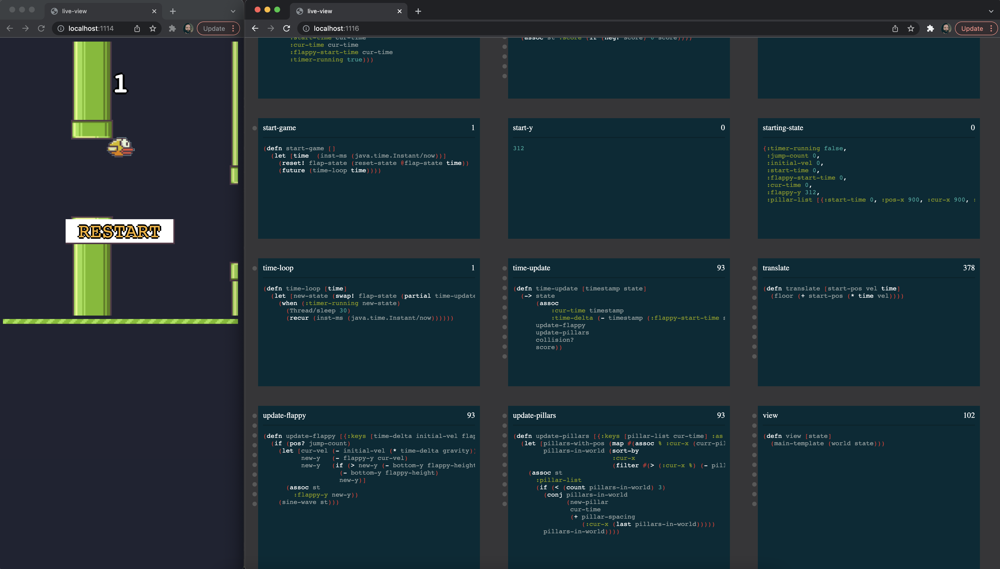

# Live View

Quick prototype of making a phoenix live-view like library for clojure. Definitely not production ready, but very fun to work on. The basic idea is that you should be able to write an app using hiccup and clojure and all logic is run on the server side. I have implemented quite a few [examples](../examples-live-view/src/examples_live_view/) (mostly directly ports from cljs examples, which shows how easy it is).

One bit I'm really happy with those is the live code inspector. You can inspect any namespace and see all the function calls being performed live. So you can watch for example the flappy bird port I made and see exactly how each function works and when they are called. It is definitely a rough interface, but super fun to play with and requires zero code changes in the application itself. In fact, it is a completely generic code inspector that works for any clojure code.

