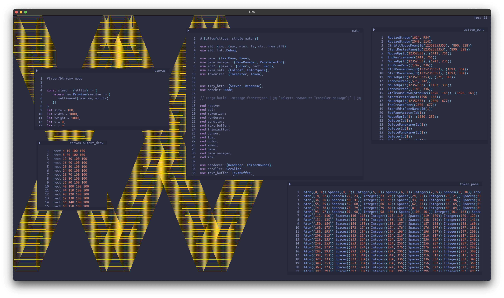

# Editor

WIP GUI Editor written in rust. Mostly for trying to get better at rust. But also to explore different editor ideas. Right now it is a simple canvas you can have multiple panes on. It can also run code and draw to itself.

